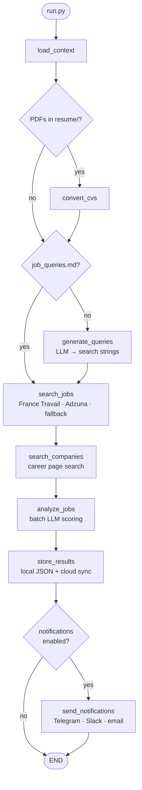

# AJSAA — Autonomous Job Search AI Agent

A LangGraph-based agent that autonomously discovers, scores, and tracks job opportunities against your CV profiles — and notifies you of the best matches.

---

## What it does

1. **Loads context** — reads your CV files (`query/resume/`) and search queries (`query/job_queries.md`)
2. **Searches for jobs** — runs queries against real job board APIs (France Travail, Adzuna, Tavily, Brave) with an LLM fallback; searches known company ATS boards (Greenhouse, Lever, Ashby) via unauthenticated HTTP — zero LLM tokens at search time
3. **Scores matches** — batch-scores each posting against your CVs using an LLM; keeps only jobs above a configurable threshold
4. **Stores results** — deduplicates by content-hash and writes to local JSON and/or cloud storage (Google Drive, OneDrive, Dropbox)
5. **Notifies you** — sends a digest to Telegram, Slack, email, or WhatsApp

## Architecture



Every provider is swappable via a single line in `config.yaml` — LLM, search connectors, storage backend, and notification channels all follow the same factory pattern.

## Results so far

Numbers from real pipeline runs against a senior product manager / data platform profile, Paris market:

| Metric | Value |
|---|---|
| Jobs discovered per run | ~19 unique postings |
| Jobs passing score threshold (≥ 70) | 15 |
| Top match score | 92 / 95 |
| Recommended to apply | 6 |
| Worth considering | 9 |
| Search queries run | 13 |
| Duplicate entries across runs | 0 (content-hash deduplication) |

Scoring uses a 0–95 scale (95 is capped to avoid inflated "perfect" scores). The LLM justifies each score in one sentence stored alongside the job record.

## Quick start

```bash
# 1. Install
python3 -m venv .venv
.venv/bin/pip install -r requirements.txt

# 2. Configure secrets (project uses Infisical — no .env files)
# Install the Infisical CLI: https://infisical.com/docs/cli/overview
# Then add secrets to your Infisical project (env: development):
#   TELEGRAM_BOT_TOKEN, TELEGRAM_CHAT_ID — for notifications
#   FRANCE_TRAVAIL_CLIENT_ID/SECRET, ADZUNA_APP_ID/KEY — for job boards
#   TAVILY_API_KEY, BRAVE_SEARCH_API_KEY — for adaptive web search (optional)

# 3. Add your CV
# Drop a PDF or .md file into query/resume/

# 4. Run
infisical run --env=development -- python run.py

# Dry-run (scores jobs without writing to storage)
infisical run --env=development -- python run.py --dry-run
```

## Configuration

All behaviour lives in `config.yaml` — no code changes needed to swap providers:

```yaml
llm:
  provider: claude_code_agent   # anthropic | openai | claude_code_agent

search:
  connectors:
    - name: france_travail       # free API — francetravail.io
    - name: adzuna               # free API — developer.adzuna.com
    - name: adaptive_web         # Tavily → Brave → LLM fallback (usage-aware routing)
      monthly_limit: 950         # per-provider threshold before switching
    - name: anthropic_web        # LLM fallback — only fires when all others return nothing
      fallback_only: true

scoring:
  min_score: 70                  # jobs below this are discarded (0–95 scale)

storage:
  provider: local                # local | google_drive | onedrive | dropbox

notifications:
  channels: [telegram]           # email | slack | telegram | whatsapp

logging:
  rotation: per_run              # none | daily | per_run
  retention: 7
```

**ATS company search** — for companies with known ATS boards, add entries to `query/hints_cache.json`:

```json
{
  "Dataiku":    "greenhouse:dataiku",
  "Qonto":      "lever:qonto",
  "Alan":       "ashby:alan"
}
```

AJSAA calls the ATS API directly (no LLM tokens) and falls back to web search for companies without a hint.

## Observability

Each run produces:

- **Live TUI** — Rich terminal dashboard updates in-place as the pipeline runs, showing node status, KPIs, and elapsed time per step
- **HTML report** — after every run, `logs/index.html` (run list) and `logs/runs/run_*.html` (per-run detail with job cards) are written automatically
- **Log rotation** — configurable via `logging.rotation` (`none` / `daily` / `per_run`) with a `retention` count

### Token usage tracking

Every LLM call is recorded with its token counts and dollar cost. The pipeline-end log line summarises the run:

```
Tokens: $0.42 total · 12345 in / 1876 out · 8 calls (sonnet $0.31, haiku $0.11)
```

Per-model and per-node breakdowns are stored on the final state as `token_usage` (shape: `{"by_model": {...}, "by_node": {...}, "grand_total": {...}}`). Prices live in `providers/llm/pricing.py` and need a manual refresh when a vendor changes its rate card — the `# Prices verified YYYY-MM-DD` comment is the canary. Unknown models log a single warning and are reported with `$0.00` cost rather than crashing.

## Tech stack

| Concern | Default |
|---|---|
| Orchestration | LangGraph |
| LLM interface | LangChain (Anthropic Claude / OpenAI) |
| Job boards | France Travail, Adzuna, Tavily, Brave Search |
| ATS boards | Greenhouse, Lever, Ashby (unauthenticated HTTP) |
| Terminal UI | Rich |
| Storage | Local JSON (Google Drive / OneDrive / Dropbox) |
| Notifications | Telegram (email / Slack / WhatsApp) |
| Secrets | Infisical |
