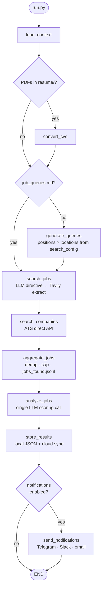

# AJSAA — Autonomous Job Search AI Agent

A LangGraph-based agent that autonomously discovers, scores, and tracks job opportunities against your CV profiles — and notifies you of the best matches.

---

## What it does

1. **Loads context** — reads your CV files (`query/resume/`), generates search queries deterministically from `config/search_config.yaml` (positions × locations cross-product), and loads target companies with their ATS hints
2. **Searches for jobs** — one directive LLM prompt returns job URLs only (no fabricated descriptions); Tavily extract validates each URL and pulls real posting content (hallucinated or unreachable URLs are dropped); company ATS boards (Greenhouse, Lever, Ashby) are queried via direct API — zero LLM tokens for ATS; all results deduplicated and checkpointed to `query/jobs_found.jsonl`
3. **Scores matches** — single LLM call scores all jobs against your CV; keeps only jobs above a configurable threshold
4. **Stores results** — deduplicates by content-hash and writes to local JSON and/or cloud storage (Google Drive, OneDrive, Dropbox)
5. **Notifies you** — sends a digest to Telegram, Slack, email, or WhatsApp

## Architecture



Every provider is swappable via the `config/` files — LLM, search connectors, storage backend, and notification channels all follow the same factory pattern.

## Results so far

Numbers from real pipeline runs against a senior product manager / data platform profile, Paris market:

| Metric | Value |
|---|---|
| Jobs discovered per run | ~19 unique postings |
| Jobs passing score threshold (≥ 70) | 15 |
| Top match score | 92 / 95 |
| Recommended to apply | 6 |
| Worth considering | 9 |
| Search queries run | 13 |
| Duplicate entries across runs | 0 (content-hash deduplication) |

Scoring uses a 0–95 scale (95 is capped to avoid inflated "perfect" scores). The LLM justifies each score in one sentence stored alongside the job record.

## Quick start

```bash
# 1. Install
python3 -m venv .venv
.venv/bin/pip install -r requirements.txt

# 2. Configure secrets (project uses Infisical — no .env files)
# Install the Infisical CLI: https://infisical.com/docs/cli/overview
# Then add secrets to your Infisical project (env: dev):
#   TELEGRAM_BOT_TOKEN, TELEGRAM_CHAT_ID — for notifications
#   TAVILY_API_KEY                        — for URL validation and extraction (required)
#   FRANCE_TRAVAIL_CLIENT_ID/SECRET       — optional free job board API
#   ADZUNA_APP_ID/KEY                     — optional free job board API

# 3. Add your CV
# Drop a PDF or .md file into query/resume/

# 4. Run
infisical run --env=dev -- python run.py

# Dry-run (scores jobs without writing to storage)
infisical run --env=dev -- python run.py --dry-run
```

## Configuration

Configuration is split across three files in the `config/` folder:

| File | What goes here |
|---|---|
| `config/config.yaml` | Infrastructure: LLM provider, connectors, storage, notifications, logging |
| `config/search_config.yaml` | User preferences: target positions, locations, companies to monitor |
| `config/score_config.yaml` | Scoring: min/max score thresholds |

`run.py` merges all three at startup. You only need to edit `config/search_config.yaml` for day-to-day use.

**`config/config.yaml`** — swap providers without touching code:

```yaml
llm:
  provider: claude_code_agent   # anthropic | openai | claude_code_agent

search:
  connectors:
    - name: anthropic_web        # primary: LLM directive search → Tavily extract
      max_results_per_query: 4
    - name: france_travail       # optional free API — francetravail.io
      enabled: false
    - name: adzuna               # optional free API — developer.adzuna.com
      enabled: false

storage:
  provider: local                # local | google_drive | onedrive | dropbox

notifications:
  channels: [telegram]           # email | slack | telegram | whatsapp

logging:
  rotation: per_run              # none | daily | per_run
  retention: 7
```

**`config/search_config.yaml`** — your search preferences:

```yaml
cvs:
  cv1:
    - "Senior Product Manager"
    - "Head of Product"
  cv2:
    - "AI Product Manager"
    - "Product Lead"

locations:
  - "Paris"
  - "Remote"

companies:
  - "Mistral AI"                            # LLM discovers ATS on first run, result cached
  - name: "Hugging Face"
    hint: "greenhouse:huggingface"          # skips LLM — uses ATS hint directly
  - name: "Criteo"
    url: "https://jobs.lever.co/criteo"     # skips LLM — fetches URL directly
```

`generate_queries` builds a deterministic cross-product of positions × locations and writes `query/job_queries.md` with a hash header — no LLM call, result cached until `search_config.yaml` changes.

**`config/score_config.yaml`** — scoring thresholds:

```yaml
scoring:
  min_score: 70                  # jobs below this are discarded (0–95 scale)
```

## Observability

Each run produces:

- **Live TUI** — Rich terminal dashboard updates in-place as the pipeline runs, showing node status, KPIs, and elapsed time per step
- **Live web monitor** — an in-process HTTP server serves a browser-based dashboard at `http://127.0.0.1:8765/` for the duration of the run (see below)
- **HTML report** — after every run, `logs/index.html` (run list with Chart.js time-series chart + 10-column table) and `logs/runs/run_*.html` (per-run detail with pipeline table, token/cost per node, and job cards) are written automatically
- **Log rotation** — configurable via `logging.rotation` (`none` / `daily` / `per_run`) with a `retention` count

### Live monitor

When the pipeline is launched via Claude Code in VS Code (which blocks the TUI) the live web monitor is the way to watch progress. `run.py` spawns a small `http.server.ThreadingHTTPServer` on `127.0.0.1:8765` and prints the URL on boot:

```
🌐 Live monitor: http://127.0.0.1:8765/  (run_id=abc12345)
```

The page polls `/state.json` every second, refreshes the pipeline table, token-spend block, and job cards in place, and stops polling automatically when the run finishes. The same HTML template is reused for the static post-run report at `logs/runs/run_*.html` (just without the JS poll block).

CLI flags (issue #62):

- `--port N` — override the default 8765 (must be 1024–65535).
- `--no-monitor` — skip the HTTP server entirely; the TUI and post-run report still work.

The server binds to `127.0.0.1` only by design — no authentication, no network exposure. It dies with `run.py` (daemon thread). If the port is busy the run continues without the monitor and logs a clear warning.

### Token usage tracking

Every LLM call is recorded with its token counts and dollar cost (issue #60). The data is surfaced in three places (issue #61):

- **Live TUI footer** — a compact line below the dashboard table refreshes at 4 Hz: `Tokens: 14.2k in / 1.9k out · $0.42 · 8 calls`
- **Pipeline-end log line** — one-line summary printed to stdout/log: `Tokens: $0.42 total · 12345 in / 1876 out · 8 calls (sonnet $0.31, haiku $0.11)`
- **HTML report** — `logs/runs/run_*.html` includes a Token spend block with grand total, per-model table, and a collapsed per-node breakdown; the pipeline table shows **Tokens** and **Cost** columns per node; `logs/index.html` adds a Chart.js time-series chart (6 selectable Y-axis metrics) and per-run columns for Status, Tokens consumed, and Cost $

Per-model and per-node totals are stored on the final state as `token_usage` (shape: `{"by_model": {...}, "by_node": {...}, "grand_total": {...}}`). Prices live in `providers/llm/pricing.py` and need a manual refresh when a vendor changes its rate card — the `# Prices verified YYYY-MM-DD` comment is the canary. Unknown models log a single warning and report `$0.00` rather than crashing.

## Tech stack

| Concern | Default |
|---|---|
| Orchestration | LangGraph |
| LLM interface | LangChain (Anthropic Claude / OpenAI) |
| Search | Claude web search (directive prompt) + Tavily extract (validation + content) |
| Job boards | France Travail, Adzuna (optional) |
| ATS boards | Greenhouse, Lever, Ashby (unauthenticated HTTP) |
| Terminal UI | Rich |
| Storage | Local JSON (Google Drive / OneDrive / Dropbox) |
| Notifications | Telegram (email / Slack / WhatsApp) |
| Secrets | Infisical |
